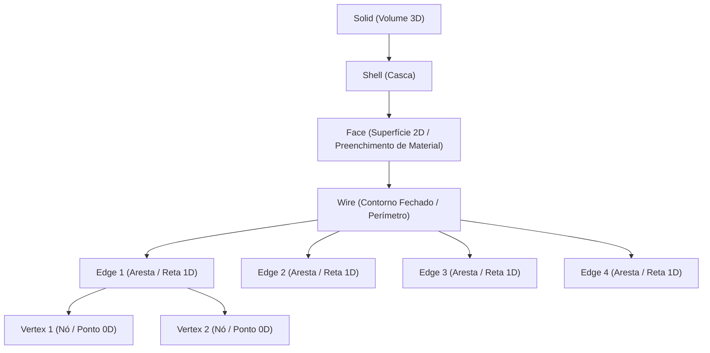

# Análise Arquitetural: Funcionamento das Primitivas, Sub-Elementos e Operações no FreeCAD

Este documento analisa a arquitetura interna do [FreeCAD](https://github.com/freecad/freecad) (baseado no kernel **OpenCASCADE Technology - OCC**), explicando como ele gerencia primitivas geométricas, seleção de sub-elementos e operações de arredondamento (*Fillet*) sem destruir a integridade do material ou das superfícies.

---

## 1. Modelo de Dados Geométrico: B-Rep (Boundary Representation)

No FreeCAD, qualquer elemento 2D ou 3D é representado através de um modelo **B-Rep** com uma hierarquia topológica estrita:

### Níveis Topológicos:
1. **Vertex (Vértice / Nó 0D)**: Um ponto de ancoragem no espaço 2D/3D.
2. **Edge (Aresta 1D)**: Um segmento de curva, arco ou reta delimitado por 2 vértices.
3. **Wire (Contorno 1D/2D)**: Uma cadeia contínua e ordenada de `Edges` conectadas.
4. **Face (Superfície 2D)**: Uma região limitada por um ou mais `Wires`. É a `Face` que carrega as **propriedades visuais e de material** (cor do couro, espessura, preenchimento, área, massa).

---

## 2. Seleção de Sub-Elementos (*Topological Naming System*)

No FreeCAD, quando o usuário clica em uma borda ou canto de um retângulo:

* **O objeto pai NÃO é decomposto**: O retângulo continua sendo um único objeto `Part::Feature` / `Sketcher::Sketch`.
* **Nomeação Topológica**: O sistema de seleção do FreeCAD registra uma referência composta:
  $$\text{Seleção} = (\text{ObjetoPaiID}, \text{"Edge1"}) \quad \text{ou} \quad (\text{ObjetoPaiID}, \text{"Vertex1"})$$

### Vantagens do Modelo FreeCAD:
* **Preservação de Material**: Como a `Face` não é destruída, o preenchimento do material (área interna do couro) permanece 100% intacto.
* **Parametrização Histórica**: A alteração de um raio em uma aresta (`Edge1`) grava uma modificação na árvore de operações (*Feature Tree*), podendo ser editada ou revertida a qualquer momento.

---

## 3. Funcionamento da Operação de Fillet (Arredondamento de Canto)

### A. No Módulo Sketcher (Rascunho 2D)
1. O usuário seleciona o vértice `Vertex1` (ou as arestas `Edge1` e `Edge2`).
2. A ferramenta `CmdSketcherFillet` remove a ponta viva.
3. O FreeCAD ajusta os pontos de tangência das arestas e adiciona uma restrição de raio $R$.
4. O `Wire` permanece fechado, garantindo que a `Face` continue preenchida.

### B. No Módulo Part / PartDesign (Sólidos e Chapas 2D)
1. A ferramenta `Part::Fillet` aceita como entrada:
   $$\text{Fillet} = \{ \text{Base: Rectangle}, \text{Edges: } [\text{"Edge1"}, \text{"Edge2"}], \text{Radius: } 5.0\text{mm} \}$$
2. O kernel recompõe a `TopoDS_Face` gerando arcos suaves nas pontas selecionadas, sem alterar as outras 2 arestas.

---

## 4. Mapeamento para a Arquitetura do LeatherCAD

Para garantir a melhor experiência de modelagem de couro no **LeatherCAD**, aplicamos este mesmo padrão do FreeCAD:

| Conceito FreeCAD | Implementação no LeatherCAD | Benefício |
| :--- | :--- | :--- |
| **`TopoDS_Face`** | `RectElement` / `ClosedPolyline` com `rTopLeft, rTopRight, rBottomRight, rBottomLeft` | A peça de couro mantém o preenchimento azul translúcido e a área de material intactos. |
| **Sub-Element Selection** | Seleção de cantos específicos ($V_1, V_2, V_3, V_4$) no `CornerRadiusDialog` | Permite arredondar apenas os cantos superiores ou inferiores sem decompor a peça. |
| **`Edge / Wire`** | Decomposição opcional (`explodeSelected()`) para quando o artesão desejar separar fisicamente a peça em tiras. | Flexibilidade total de edição. |
