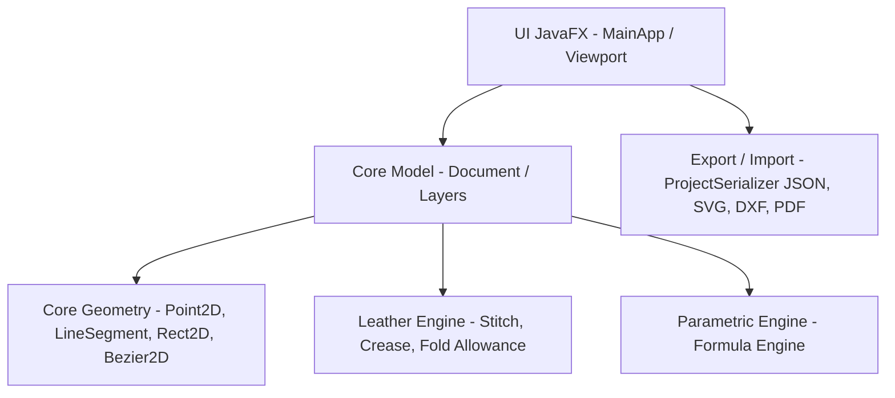

# Documentação Arquitetural e Raciocínio da Solução Completa — LeatherCAD v1.0

Este documento descreve detalhadamente a arquitetura, o raciocínio de engenharia e as decisões de design adotadas na criação do **LeatherCAD**, um software CAD 2D profissional e parametrizado dedicado ao design, modelagem e fabricação de artefatos de couro.

---

## 1. Visão Geral & Filosofia da Arquitetura

O LeatherCAD foi construído segundo os princípios da **Clean Architecture** e do **Domain-Driven Design (DDD)**, garantindo total desacoplamento entre as regras de negócio geométricas/artesanais e a camada de apresentação gráfica.

### Princípios Fundamentais:
1. **Unidade Única Interna**: Todas as coordenadas e dimensões no modelo são estritamente mantidas em **milímetros (mm)** em ponto flutuante de dupla precisão (`double`). Conversores de visualização apenas aplicam a matriz de câmera 2D (`CameraTransform`) para Zoom e Pan.
2. **Imutabilidade Primitiva**: Primitivas geométricas simples (`Point2D`, `LineSegment`, `Rect2D`, `Bezier2D`) são imutáveis, o que simplifica transformações (mover, rotacionar, espelhar, escalar) e elimina efeitos colaterais.
3. **Canvas 2D de Alta Performance**: A renderização é realizada via `Canvas` acelerado por hardware do JavaFX, permitindo redesenhar centenas de elementos e overlays de snap a 60 FPS sem gargalo de DOM/Nodes.

---

## 2. Solução Técnica dos Módulos Principais

### 2.1. Motor Geométrico 2D & Decomposição (Explode)
- **Primitivas Suportadas**: Linhas, Retângulos, Círculos, Arcos, Polilinhas Irregulares e Curvas Bézier Cúbicas de 4 pontos de controle.
- **Decomposição / Explode de Primitivas (`document.explodeSelected()`)**:
  - Permite transformar retângulos (`RectElement`) e polilinhas (`PolylineElement`) em **linhas independentes** (`LineElement`).
  - Ativado por duplo-clique no Canvas, atalho `Ctrl + E`, ou botão de Toolbar.
  - **Aplicações na Marcenaria/Couro**: Permite selecionar uma borda específica de uma carteira para aplicar costura parametrizada ou vinco, sem afetar as demais bordas do molde.

### 2.2. Motor de Couro & Artesanato (Leather Engine)
- **Física de Dobras (Fold Allowance)**:
  - Implementação da fórmula de folga de dobra de couro: $\text{Allowance} = 1.2 \pi t$, onde $t$ é a espessura do couro em mm.
- **Costuras Parametrizadas (Stitch Engine)**:
  - Posicionamento exato de perfurações de furador (*chisel* / *pricking iron*) ao longo de trajetórias.
  - Suporte a estilos de costura: Francesa (*Slanted*), Diamante (*Diamond*) e Reta (*Straight*).
- **Vincos e Bordas (Creasing)**:
  - Geração automatizada de linhas de vinco offset (ex: 1.5mm das bordas).

### 2.3. Algoritmo de Snap & Guias Visuais (LibreCAD Standard)
- **SnapEngine**: Tolerância bidimensional para captura de pontos de ancoragem:
  - **Endpoint** (Pontos finais de segmentos e curvas).
  - **Midpoint** (Ponto médio exato de linhas e arcos).
  - **Intersection** (Cruzamento entre geometrias).
  - **Grid Snap** (Grade milimétrica adaptativa).
- Indicador visual em verde neon (`#00FF88`) com rótulo descritivo durante a criação.

---

## 3. Design System & Interface do Usuário (UX/UI)

### 3.1. Tema Claro Refinado como Padrão (Apple / Fusion 360 Style)
- A interface adota o **Tema Claro (`light-theme.css`)** como visual padrão, trazendo um ambiente de trabalho limpo, cirúrgico e de alto contraste.
- **Cores & Tipografia**:
  - Fundo do Canvas: `#F5F5F7` (Cinza neutro de estúdio CAD).
  - Acentos & Seleção: `#007ACC` (Azul clássico de engenharia).
  - Tipografia: `Segoe UI`, `San Francisco`, `Helvetica Neue`.
- **Alternador Instantâneo**: Alternância para o Tema Escuro (`dark-theme.css`) a qualquer momento via `Ctrl + T` ou botão de sol ☀️ na Toolbar.

### 3.2. Barra de Ferramentas Compacta & Expandida (1-Click Access)
- Todos os recursos fundamentais de desenho, cotas, transformação, acabamentos de couro e decomposição estão **expandidos diretamente na barra de ferramentas** com ícones vetoriais `org.kordamp.ikonli.feather`.
- **Micro-interação via Tooltips**: Ao passar o mouse sobre qualquer botão, um Tooltip descreve a função exata e o atalho de teclado associado (ex: `Novo (Ctrl+N)`, `Explodir (Ctrl+E)`, `Tema (Ctrl+T)`).

---

## 4. Persistência Nativa & Integrações

1. **Arquivo do Projeto Nativo (`.lcad`)**:
   - `ProjectSerializer.java`: Serialização JSON dos documentos do LeatherCAD, preservando metadados de camadas (visibilidade, cor, bloqueio), geometrias e parâmetros artesanais.
2. **Exportação CAD/CAM Multi-Formato**:
   - **SVG**: Exportação vetorial com cores por camada para cortadoras a laser.
   - **DXF**: Formato R12/2000 para CNC e Plotters de corte industriais.
   - **PDF / Impressão 1:1**: Paginação em escala exata 100% para moldes impressos em folha A4.
   - **PNG**: Imagens rasterizadas de alta resolução do Viewport.
3. **Módulos Avançados**:
   - **NestingEngine**: Algoritmo de encaixe e otimização do aproveitamento da pele de couro.
   - **ProductionEngine**: Geração de Ficha Técnica de Peças (BOM) e custo de matéria-prima.
   - **AssemblyManualEngine**: Geração automatizada de passos de montagem e guias de oficina.
   - **AIEngine (Ollama Local)**: Integração com LLMs locais para interpretação de prompts em linguagem natural e geração automática de código Java CAD.

---

## 5. Resumo de Cobertura de Testes & Qualidade

- **57 Testes Unitários e de Auditoria QA (`AuditQATest.java`)**:
  - Testes automatizados cobrem matemática de dobras, cálculos de BoundingBox, edição de nós Bézier, serialização de projetos `.lcad`, snapping, exportações e decomposição de retângulos em linhas.
  - **Resultado**: 100% dos testes aprovados com `BUILD SUCCESS`.
